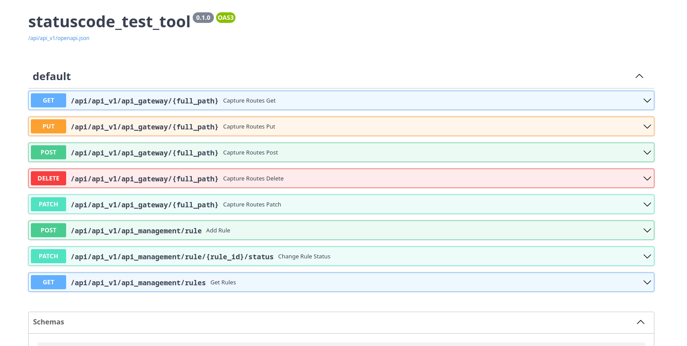
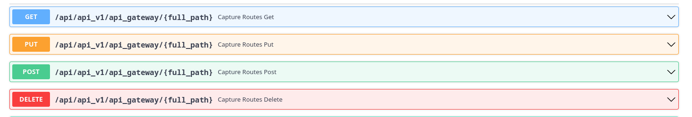
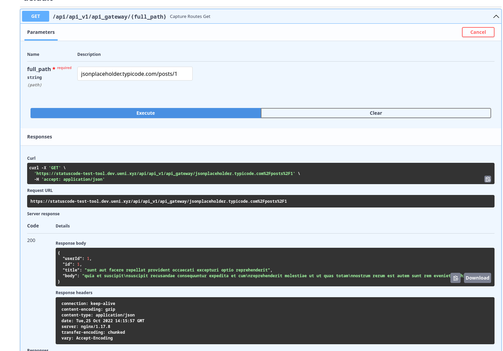
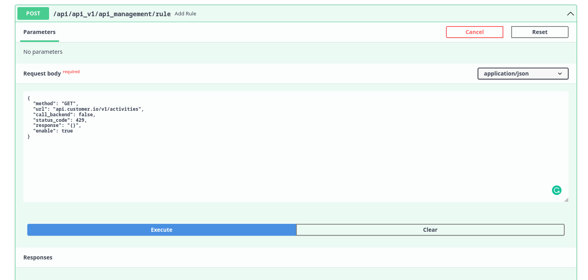
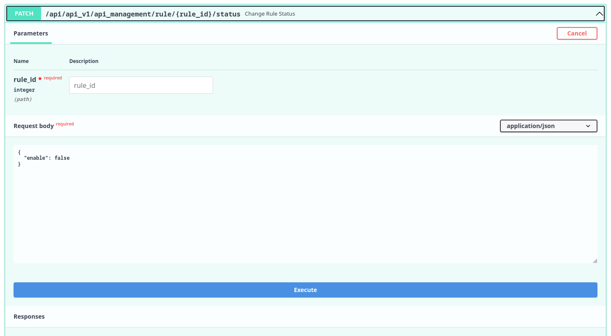

# Moxie

Moxie is a high-performance network mediator that sits at the edge of your internal infrastructure, giving you total control over outbound API traffic. By acting as a transparent bridge or a sophisticated mock server, it allows developers and SREs to:

- Simulate Reality: Return custom JSON or XML payloads and status codes to validate how internal systems handle specific API behaviors.
- Engineer Chaos: Inject precision latency and custom error states to test system resilience and timeout configurations under pressure.
- Bridge the Gap: Maintain full transparency for standard traffic while selectively intercepting specific endpoints for debugging or local development.

version: 0.1


some of our services, require external APIs like Cloudflare and customer.io. these kinds of services, sometimes return some exception codes, like 429 and these codes will interrupt our service's routine tasks.
to cope with this kind of exception, we used BackOff mechanisms.\
but we are unable to test those in DEV or STG environment. because any interruption for our outgoing gateway will affect all of our services.
for this purpose, we decided to implement our custom API gateway.\
this API gateway should be worked in the transparent mode and should pass every request to the destination. Based on test requirements, we should be able to add a rule to change status_code or response content.

# How to use
This project is based on the FastApi and thus there is a Swagger WUI to working with the APIs.
We can change normal working route by adding rules. for example, we have some requests to customer.io url.\
normally those requests goes through our gateway without any changes. by using statuscode_test_tool, we can change request or response.\
take this as an example:
we want to test `api.customer.io/v1/activities` api call that called by customer-io service. this is the steps:
1. change the base service url (in this example `https://api.customer.io/v1/`) in our service in test (customer-io). most of the URLs defined by ENV in the Deploy project
2. it's possible to test multiple remote transparent requests
  
  
  note: by using this website, can mock api calls: https://jsonplaceholder.typicode.com/guide/
3. now all the customer-io requests should route by the `statuscode_test_tool` (everything should work as before)
4. now assume we want to interrupt this request: `GET` > `https://api.customer.io/v1/activities` with statuscode 429
5. add a rule to `statuscode_test_tool` with this body:
    ```json
    {
      "method": "GET",
      "url": "api.customer.io/v1/activities",
      "call_backend": false,
      "status_code": 429,
      "response": "{}",
      "enable": true,
      "mock_count": 3,
      "response_delay": 4,
      "response_media_type": "application/json"
    }
    ```
    
    note: for `url` there is not `http://` or `https://`
6. now the request should fail
7. by patching the rules, it's possible to disable/enable the rules


# local run/develop
- install requirements:
`pip install -r requirements.txt`
- create `.env` file
```
# Postgres
DB_HOST=postgres
DB_USER=postgres
DB_PASSWORD=111111
DB_DATABASE=statuscode_tool

# test_postgres
TEST_DB_HOST=postgres
TEST_DB_USER=postgres
TEST_DB_PASSWORD=111111
TEST_DB_DATABASE=statuscode_tool
```

## rule structure
- method: string, that identify REST methods (GET, POST, PUT, DELETE, PATCH)
- url: string, regex that match our url. for example:
  - `test_url/api/.*/id` will match: `test_url/api/api_v1/id`, `test_url/api/api_v2/id` and `test_url/api/test/id`
  - `test_url/api/api_v1/id` will match: `test_url/api/api_v1/id`
- call_backend: require to still call the destination or not
- status_code: return status code
- response: response as json format
- enable: rule enable or not
- mock_count: how many times this rule should work. -1: without limitation, 0: dont call, x>0: call x times 
- response_delay: delay until custom response returned

## address
- STG: https://statuscode-test-tool.staging.ueni.xyz/
- DEV: https://statuscode-test-tool.dev.ueni.xyz/

## rule examples
### disable customer.io unsuppress endpoint (5 times)
```json
{
    "method": "POST",
    "url": "track.customer.io/api/v1/customers/.*/unsuppress",
    "call_backend": false,
    "custom_headers": {},
    "status_code": 429,
    "response": "{\"key\": \"value\"}",
    "enable": true,
    "mock_count": 5,
    "response_delay": 0,
    "response_media_type": "application/json"
}
```
### example 2:
```json
{
  "method": "GET",
  "url": "api.cloudflare.com/client/v4/zones/.*/ssl/universal/settings",
  "call_backend": false,
  "custom_headers": {},
  "status_code": 200,
  "response": "{\"errors\":[],\"messages\":[],\"result\":{\"enabled\":true},\"success\":true}",
  "enable": true,
  "mock_count": -1,
  "response_delay": 1,
  "response_media_type": "application/json"
}
```
### xml example
```json
{
  "method": "GET",
  "url": "test_url.com/xml_reponse",
  "call_backend": false,
  "custom_headers": {},
  "status_code": 200,
  "response": "<studentsList>  <student  id=\"1\">  <firstName>Greg</firstName>  <lastName>Dean</lastName>  <certificate>True</certificate>  <scores>  <module1>70</module1>  <module12>80</module12>  <module3>90</module3>  </scores>  </student>  <student  ind=\"2\">  <firstName>Wirt</firstName>  <lastName>Wood</lastName>  <certificate>True</certificate>  <scores>  <module1>80</module1>  <module12>80.2</module12>  <module3>80</module3>  </scores>  </student>  </studentsList>",
  "enable": true,
  "mock_count": -1,
  "response_delay": 1,
  "response_media_type": "application/xml"
}
```

# Development
## autogenerate alembic model
`PYTHONPATH=app alembic revision --autogenerate -m 'name'`

## run migrations
`PYTHONPATH=app alembic upgrade head`

## local execution
`PYTHONPATH=app uvicorn app.main:app --reload --port 8080`

## ToDo
- [ ] add response based on request data (json)
- [ ] add response based on request parameters
- [x] fix ? in url (maybe \ in regex)
  - example: `"url": "api.cloudflare.com/client/v4/zones/\?name=.*"`
- [x] response accept any type of data (not only json, for example xml)
- [ ] add webhook fire